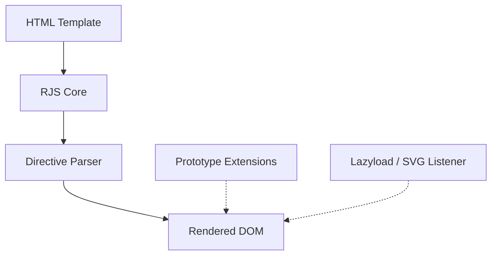

> [!NOTE]
> This README was generated by [SKILL](https://github.com/pardnchiu/skill-readme-generate), get the ZH version from [here](./doc/README.zh.md).

***

<picture>

</picture>

<strong>EXTEND NATIVE JS PROTOTYPES, RENDER WITHOUT THE OVERHEAD</strong>

  
  
  

***

> A JavaScript frontend rendering tool with chainable DOM syntax, a one-shot template engine, and native prototype extensions

## Table of Contents

- [Features](#features)
- [Architecture](#architecture)
- [License](#license)
- [Author](#author)

## Features

> `npm i @pardnchiu/renderjs` · [Documentation](./doc/doc.md)

- **Chainable DOM construction** — Build real DOM elements from tag-selector strings like `"div.card#id"._({...}, [children])`, replacing verbose `createElement` chains.
- **One-shot template engine** — `RJS` offers declarative `:if`/`:for`/`:model`/`{{ }}` directives that render straight to the DOM in a single pass, with no virtual-DOM diffing; updates are triggered manually via `renew()`, avoiding the overhead of automatic reactive watching.
- **Native prototype extensions** — Adds dozens of chainable methods to `String`/`Array`/`Object`/`Element`/`URL`/`window` (e.g. `_child`, `_class`, `$req`, `$shuffle`, negative-index access, query-string builders), with no runtime dependency.
- **Built-in lazyload and SVG inlining** — `_Listener({ lazyload, svg })` enables `IntersectionObserver`-based image lazy loading and automatic SVG inlining in one line.
- **Zero-dependency, drop-in setup** — A single minified `dist/RenderJS.js` file, installable via npm or a CDN `<script>` tag, runs directly in the browser.

## Architecture

> [Full Architecture](./doc/architecture.md)

## License

This project is licensed under the [MIT License](LICENSE).

## Author

<h4 style="padding-top: 0">邱敬幃 Pardn Chiu</h4>

<a href="mailto:hi@pardn.io">hi@pardn.io</a> 
<a href="https://www.linkedin.com/in/pardnchiu">https://www.linkedin.com/in/pardnchiu</a>

***

©️ 2022 [邱敬幃 Pardn Chiu](https://www.linkedin.com/in/pardnchiu)
