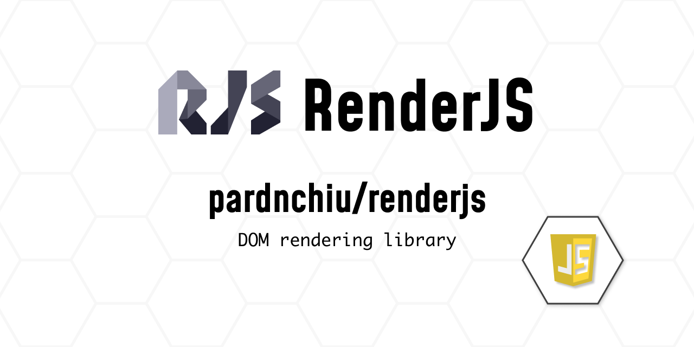
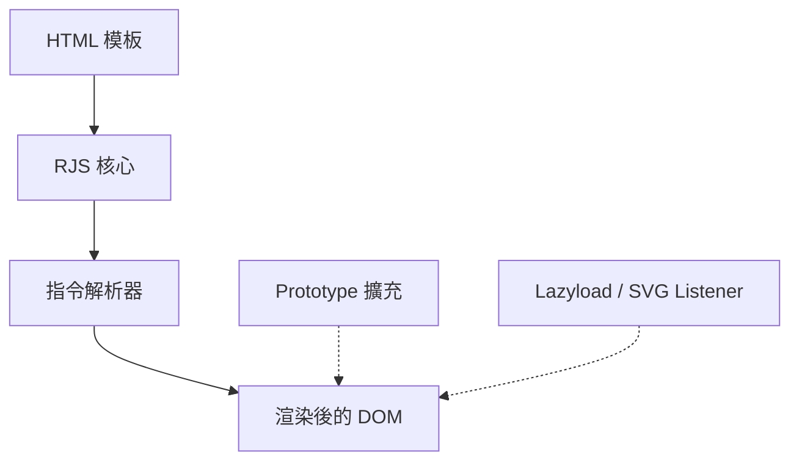

> [!NOTE]
> 此 README 由 [SKILL](https://github.com/pardnchiu/skill-readme-generate) 生成，英文版請參閱 [這裡](../README.md)。

***

<picture>

</picture>

<strong>EXTEND NATIVE JS PROTOTYPES, RENDER WITHOUT THE OVERHEAD</strong>

***

> RenderJS 是一款純 JavaScript 前端渲染工具，具備鏈式 DOM 語法、one-shot 模板引擎與原生 prototype 擴充

## 目錄

- [功能特點](#功能特點)
- [架構](#架構)
- [授權](#授權)
- [Author](#author)

## 功能特點

> `npm i @pardnchiu/renderjs` · [完整文件](./doc.zh.md)

- **鏈式 DOM 建構語法** — 以 `"div.card#id"._({...}, [children])` 這類標籤選擇器字串直接產生真實 DOM，取代冗長的 `createElement` 呼叫鏈。
- **One-shot 模板引擎** — `RJS` 提供 `:if`／`:for`／`:model`／`{{ }}` 宣告式指令，渲染為單次直接寫入 DOM，不做虛擬 DOM 比對，更新交由 `renew()` 手動觸發，避免自動監聽帶來的效能負擔。
- **原生物件 prototype 擴充** — 為 `String`／`Array`／`Object`／`Element`／`URL`／`window` 新增數十個鏈式方法（如 `_child`、`_class`、`$req`、`$shuffle`、負索引存取、query string 建構器），無需額外執行期依賴。
- **內建 Lazyload 與 SVG 內嵌** — `_Listener({ lazyload, svg })` 一行啟用基於 `IntersectionObserver` 的圖片延遲載入與 SVG 自動內嵌。
- **零依賴、免建置導入** — 單一 minified 檔案 `dist/RenderJS.js`，支援 npm 安裝或 CDN 直接引入，瀏覽器端即可運行。

## 架構

> [完整架構](./architecture.zh.md)

## 授權

本專案採用 [MIT License](../LICENSE)。

## Author

<h4 style="padding-top: 0">邱敬幃 Pardn Chiu</h4>

<a href="mailto:hi@pardn.io">hi@pardn.io</a> 
<a href="https://www.linkedin.com/in/pardnchiu">https://www.linkedin.com/in/pardnchiu</a>

***

©️ 2022 [邱敬幃 Pardn Chiu](https://www.linkedin.com/in/pardnchiu)
