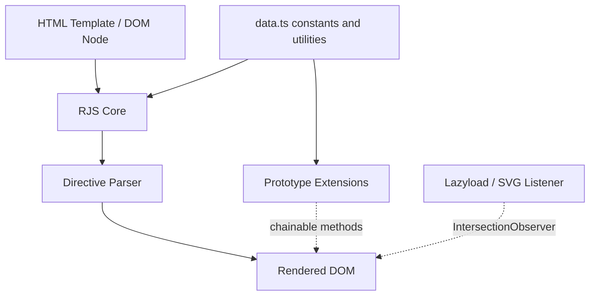
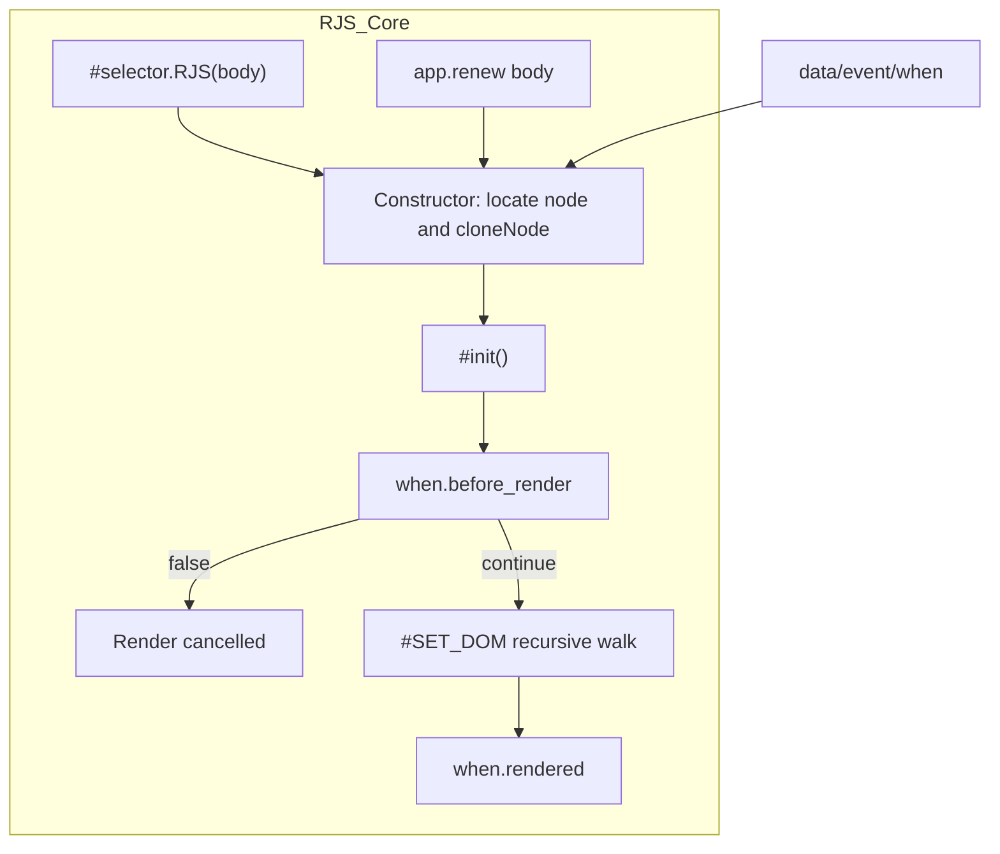
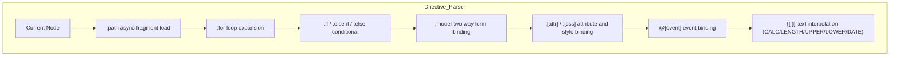
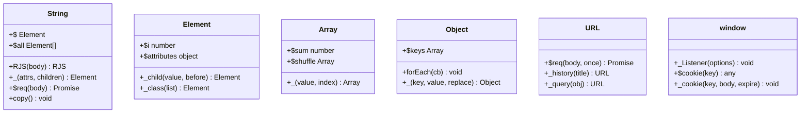
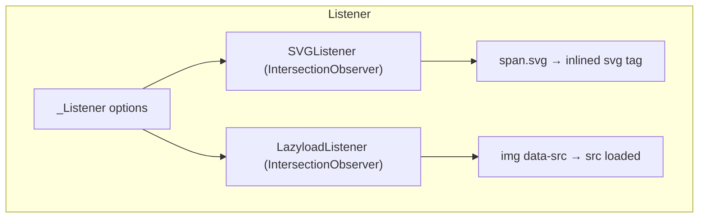

# RenderJS - Architecture

> Back to [README](../README.md)

## Overview

## Module: RJS Core

The `RJS` class (`src/model/RJS.ts`) is the container for each render instance. It holds a clone of the original DOM template, lifecycle callbacks, and data/event definitions, and drives the directive-parsing pass.

## Module: Directive Parser

`#SET_DOM` applies template directives to each node in order; `:for`/`:if` support nesting, and `{{ }}` interpolation can invoke helper functions.

## Module: Prototype Extensions

Each `src/prototype/*.ts` file extends the corresponding native prototype directly on load; `src/interface/*.ts` provides the matching TypeScript type declarations.

## Module: Listener

`_Listener({ svg, lazyload })` sets up global `IntersectionObserver` listeners, delegating to `SVGListener` and `LazyloadListener` for elements entering the viewport.

***

©️ 2022 [邱敬幃 Pardn Chiu](https://www.linkedin.com/in/pardnchiu)
