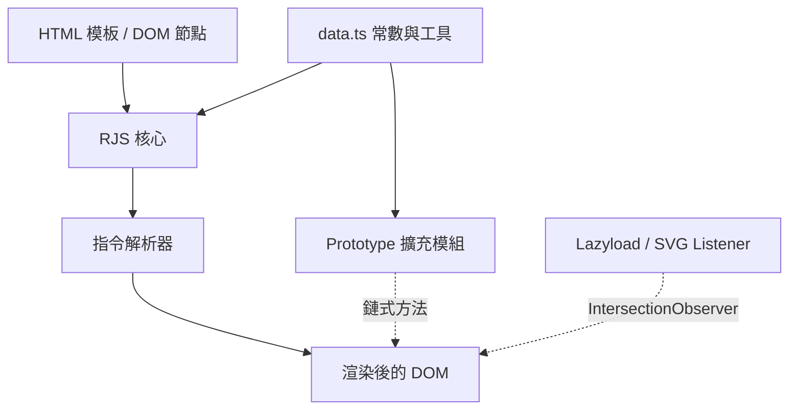
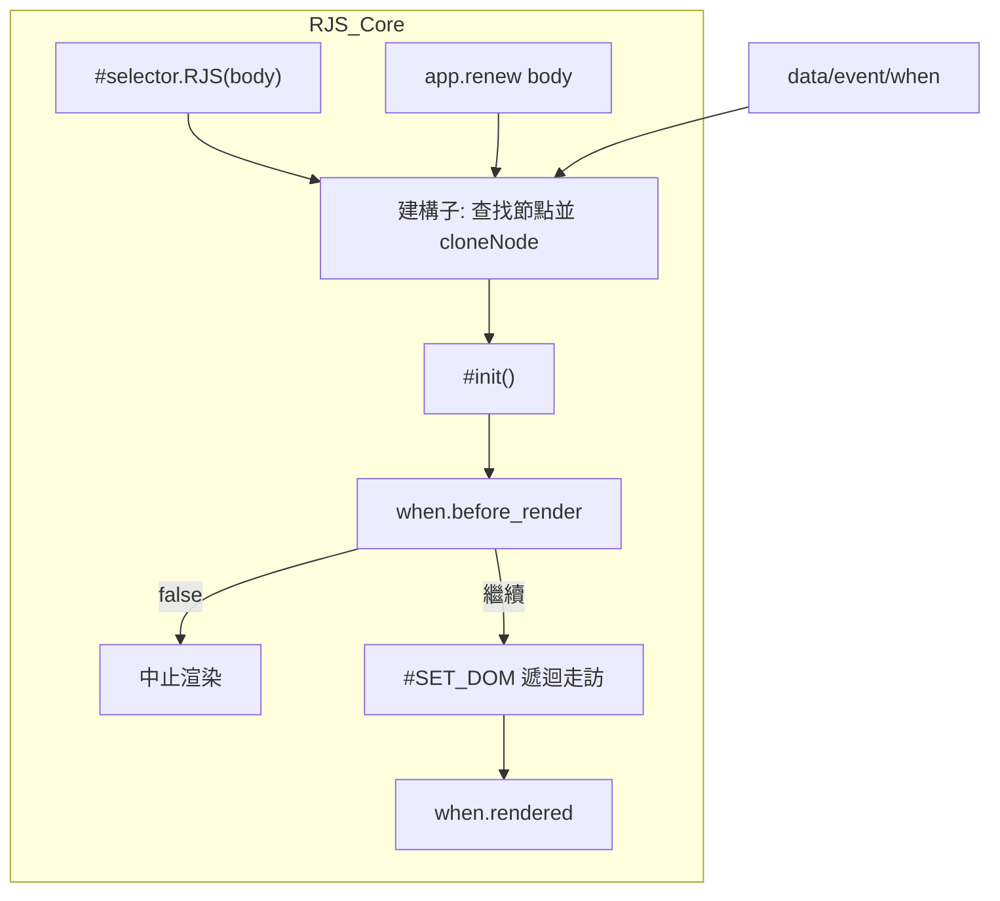
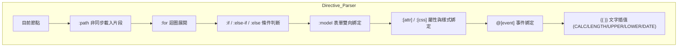
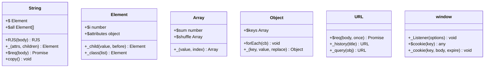
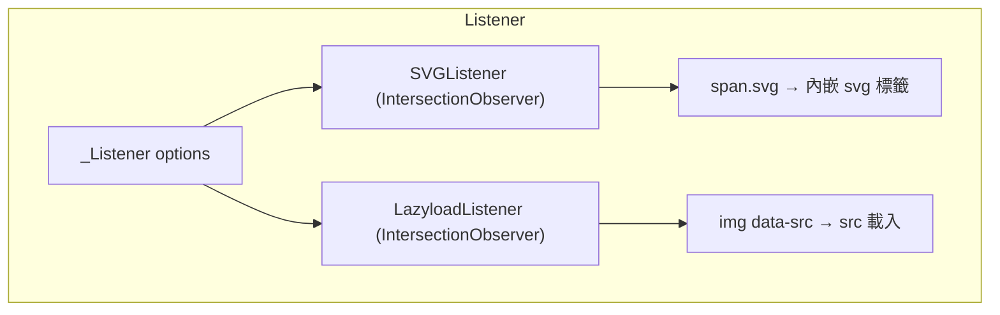

# RenderJS - 架構

> 返回 [README](./README.zh.md)

## 概覽

## Module: RJS 核心

`RJS` 類別（`src/model/RJS.ts`）為每個渲染實例的容器，負責保存原始 DOM 模板的複本、生命週期回呼與資料/事件定義，並驅動指令解析流程。

## Module: 指令解析器

`#SET_DOM` 針對每個節點依序套用模板指令；`:for`／`:if` 支援巢狀，`{{ }}` 內可呼叫輔助函式。

## Module: Prototype 擴充

各 `src/prototype/*.ts` 檔案在載入時直接擴充對應的原生 prototype，`src/interface/*.ts` 提供對應的 TypeScript 型別宣告。

## Module: Listener

`_Listener({ svg, lazyload })` 建立全域的 `IntersectionObserver` 監聽器，分別交由 `SVGListener` 與 `LazyloadListener` 處理進入視窗範圍的元素。

***

©️ 2022 [邱敬幃 Pardn Chiu](https://www.linkedin.com/in/pardnchiu)
